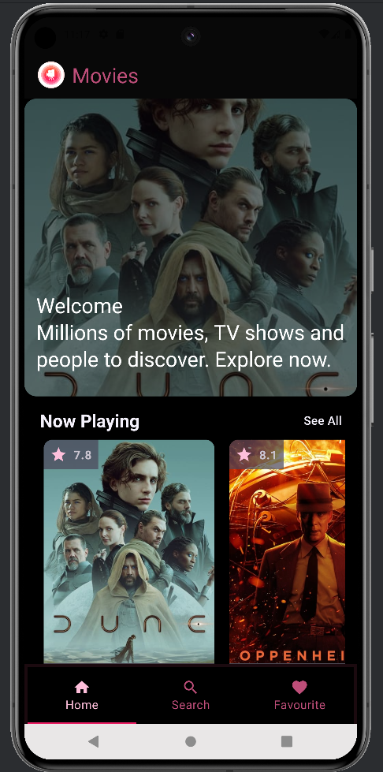
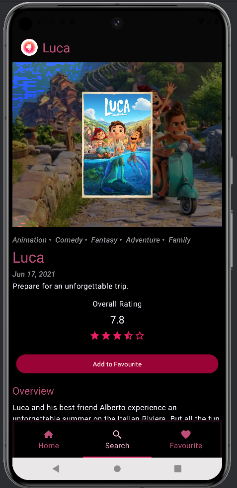
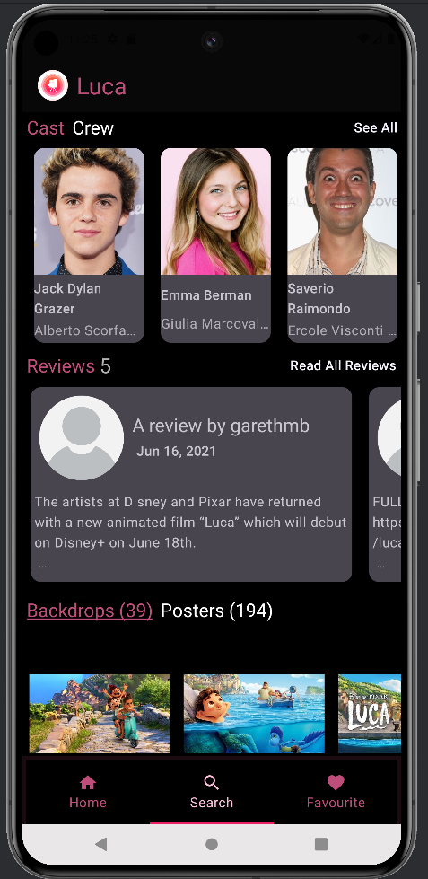
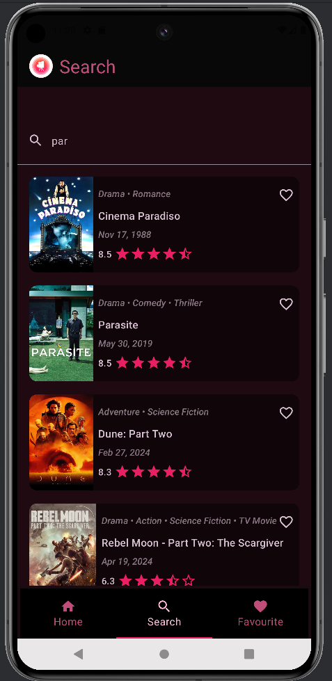
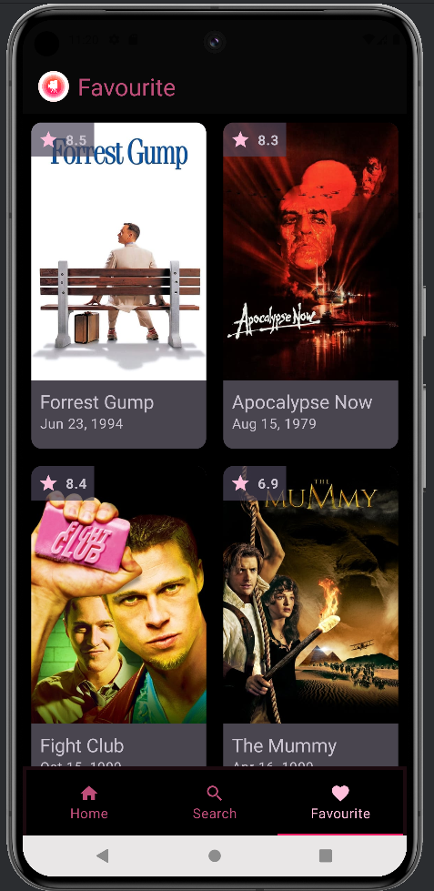

# Movies Explore Application

## Overview

This mobile application allows users to explore movies, categorized for easy browsing. Users can
search for specific movies, add favorites for quick access, and view detailed information on each
film, including cast, reviews, ratings, and trailers.

## Technical Specifications

### Programming Language

- Kotlin

### Libraries/Frameworks :

- Jetpack Compose (UI framework)
- Room (Database)
- Retrofit (Networking)
- Hilt (Dependency Injection)
- ViewModels (Data management)
- State Management Library (Flow)

### API Integration

- Integrates with the Movie Database API: https://developer.themoviedb.org/reference/movie-details
  to retrieve movie information, including titles, posters, genres, cast, crew, reviews, ratings,
  trailers, etc.
- Uses Retrofit for making network requests and parsing JSON responses.

### Clean Architecture

- This project leverages Clean Architecture for better maintainability. Separated layers (
  presentation, domain, data) promote independent testing and easier modifications. The domain
  layer, free from UI or database specifics, allows for flexible future tech changes. This approach
  fosters code re-usability and clear separation of concerns, leading to a robust and adaptable movie
  application.

## Features

> Movies Home Screen:

- Display movies sorted by category.
- "See More" option for each category to explore more movies with pagination. Clicking this will
  navigate to the category screen.

> Search Option:

- Allow users to search for movies by title.
- Provides overview of the listed movie.

> Favorite Tab:

- Enable users to modify movies' favorite status for easy access.
- View all favorite movies in a dedicated tab.

> Movie Detail Screen:

- Display detailed information about each movie, including: Title, Poster, Genre(s), Duration ,
  Release date, Cast and crew (separate screen accessible from here), Reviews (separate screen
  accessible from here), Rating, Images, Budget, Revenue, Recommendation movies, Trailer video as a
  YouTube video

> Cast and Crew Screen:

- Provide a dedicated screen showcasing the cast and crew for each movie.

> Review Screen:

- Allow users to view all reviews for a particular movie.

## Dependencies

- **Jetpack Compose**:
  ```gradle
    implementation("androidx.lifecycle:lifecycle-runtime-ktx:2.7.0")
    implementation("androidx.lifecycle:lifecycle-runtime-ktx:2.7.0")
  ```
- **Room**:
  ```gradle
    implementation("androidx.room:room-ktx:2.6.1")
    kapt("androidx.room:room-compiler:2.6.1")
    implementation("androidx.room:room-paging:2.6.0")
  ```
- **Retrofit**:
  ```gradle 
    implementation("com.squareup.retrofit2:retrofit:2.9.0")
    implementation("com.squareup.retrofit2:converter-gson:2.9.0")
    implementation("com.squareup.okhttp3:okhttp:4.11.0")
    implementation("com.squareup.okhttp3:logging-interceptor:4.10.0")
  ```
- **Dagger-Hilt**:
  ```gradle
    implementation("com.google.dagger:hilt-android:2.51.1")
    kapt("com.google.dagger:hilt-compiler:2.51.1")
    kapt("androidx.hilt:hilt-compiler:1.2.0")
    implementation("androidx.hilt:hilt-navigation-compose:1.2.0")
  ```
- **Serialization**:
  ```gradle
    implementation("com.jakewharton.retrofit:retrofit2-kotlinx-serialization-converter:1.0.0")
  ```
- **Coil**:
  ```gradle
    implementation("io.coil-kt:coil-compose:2.6.0")
  ```
- **YouTube Player**:
  ```gradle
    implementation ("com.pierfrancescosoffritti.androidyoutubeplayer:chromecast-sender:0.28")
  ```
- **Navigation**:
  ```gradle 
    implementation ("androidx.navigation:navigation-compose:2.4.0-alpha04")
  ```

## Screenshots








## Conclusion

Explore a cinematic world with our user-friendly movie app, driven by Jetpack Compose. With
categorized browsing, search, favorites, and detailed movie info, it's a must-have for movie lovers.
Powered by Kotlin, Room, and potentially TMDB API, it ensures a smooth experience. Whether finding
new favorites or revisiting classics, our app offers a convenient and informative platform for all
movie enthusiasts.